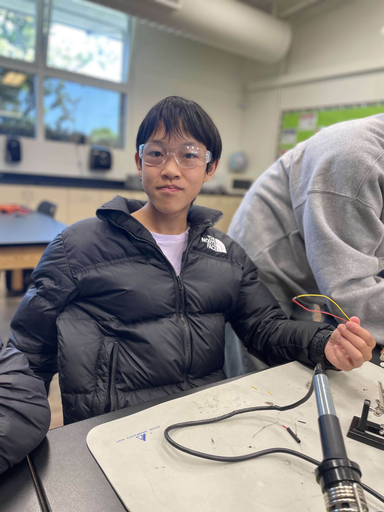
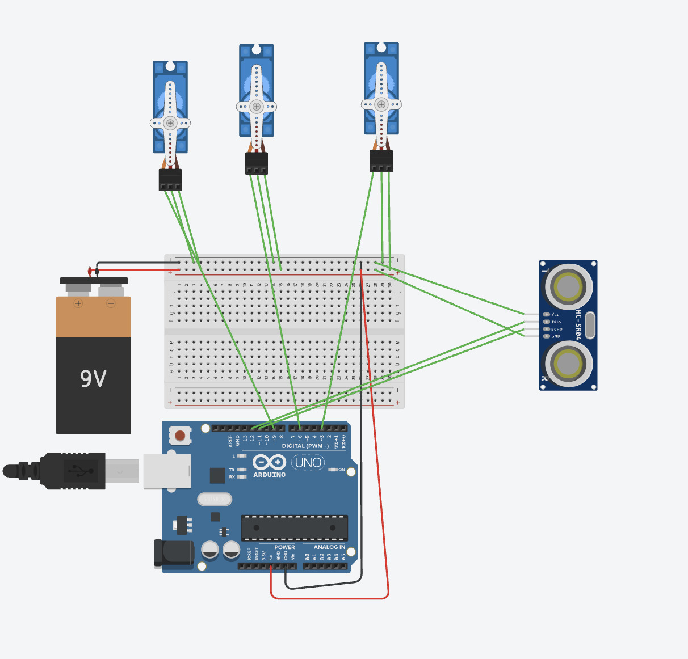
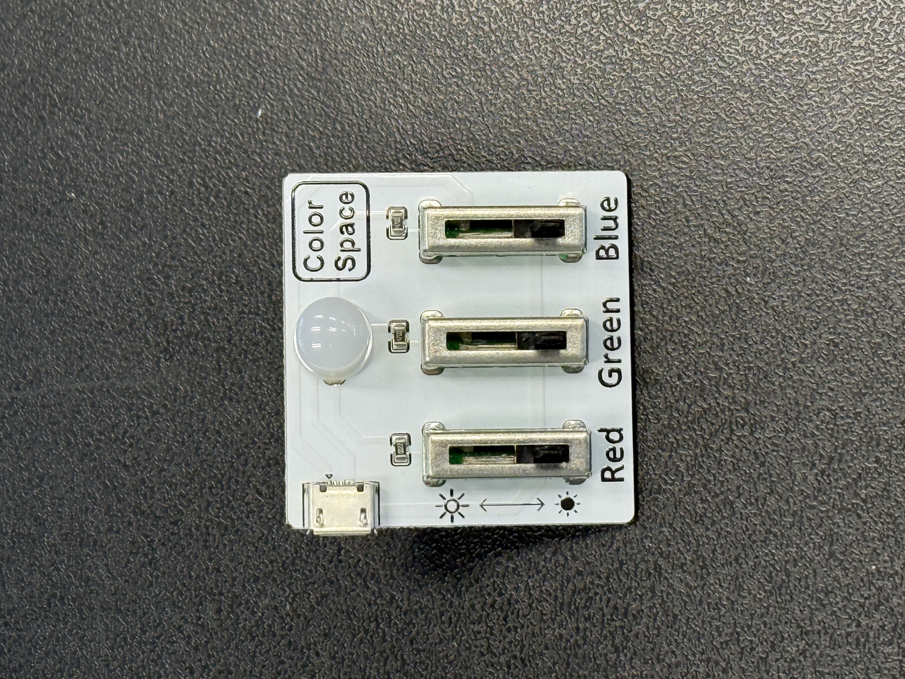

# Rock Paper Scissors
The rock, paper, and scissors game randomly chooses one of the sticks which will be used to play against you. It senses if your hand is twenty centimeters or closer and cooses a stick. It uses 3 servos and a ultrasonic sensor, as well as a arduino board with wires and breadboards.


| **Engineer** | **School** | **Area of Interest** | **Grade** |
|:--:|:--:|:--:|:--:|
| Ian C. | Northgate High School |STEM| 9th grader


  

# Final Milestone <!--- DIDNT DO -->

**Don't forget to replace the text below with the embedding for your milestone video. Go to Youtube, click Share -> Embed, and copy and paste the code to replace what's below.**

<iframe width="560" height="315" src="https://www.youtube.com/embed/XZ90QMi0aBw?si=F6m3viqu-RIetxs1" title="YouTube video player" frameborder="0" allow="accelerometer; autoplay; clipboard-write; encrypted-media; gyroscope; picture-in-picture; web-share" referrerpolicy="strict-origin-when-cross-origin" allowfullscreen></iframe>

For your final milestone, explain the outcome of your project. Key details to include are:
- What you've accomplished since your previous milestone
- What your biggest challenges and triumphs were at BSE
- A summary of key topics you learned about
- What you hope to learn in the future after everything you've learned at BSE

  I have added wheels to my box and made a rubber band to launcher to attach to my box later as a prank when people put thier hand in front of the ultrasonic sensor. Along the way, the rubber band launcher's wiring was kind of hard and confusing.
  


# Second Milestone

<iframe width="560" height="315" src="https://www.youtube.com/embed/NtIcOKggFbA?si=OMmbDALPtIFQoETY" title="YouTube video player" frameborder="0" allow="accelerometer; autoplay; clipboard-write; encrypted-media; gyroscope; picture-in-picture; web-share" referrerpolicy="strict-origin-when-cross-origin" allowfullscreen></iframe>


  On my first milestone, the code worked but it couldn't run without it constantly having to be connected to my computer. However, I have made it so that it can run on its own with the battery and is put in a box with servos. The servos have popsicle sticks attached to them with paper with rock, paper, and scissors drawn on them. Along the way, I accidently connected the servos wrong and this caused me to brainstorm and I thought of the idea of adding a fan and wheels. On my third and final milestone, I will be finishing my modifications and having the whole project completed.

  Code that works without having to be connected to my computer
```c++
#include <Servo.h>

// HC-SR04 sensor pins
#define TRIG_PIN 12
#define ECHO_PIN 11

// Servo objects
Servo servo_3;
Servo servo_6;
Servo servo_9;

void setup() {
 Serial.begin(9600);

 // Sensor pins
 pinMode(TRIG_PIN, OUTPUT);
 pinMode(ECHO_PIN, INPUT);

 // Attach servos
 servo_3.attach(3);
 servo_6.attach(6);
 servo_9.attach(9);

 // Set to neutral
 servo_3.write(90);
 servo_6.write(90);
 servo_9.write(90);

 randomSeed(analogRead(0)); // Seed random
}

void loop() {
 float distance = readDistance();

 Serial.print("Distance: ");
 Serial.print(distance);
 Serial.println(" cm");

 // Only trigger servo if distance is valid and <= 20
 if (distance > 0 && distance <= 20) {
   int randomServo = random(1, 4); // 1 to 3

   switch (randomServo) {
     case 1:
       servo_3.write(179);
       delay(1000);
       servo_3.write(90);
       break;

     case 2:
       servo_6.write(179);
       delay(1000);
       servo_6.write(90);
       break;
     case 3:
       servo_9.write(179);
       delay(1000);
       servo_9.write(90);
       break;
   }

   delay(500); // Short pause after action
 }

 delay(200); // General delay between checks
}

// Reads distance in cm
float readDistance() {
 digitalWrite(TRIG_PIN, LOW);
 delayMicroseconds(2);
 digitalWrite(TRIG_PIN, HIGH);
 delayMicroseconds(10);
 digitalWrite(TRIG_PIN, LOW);

 long duration = pulseIn(ECHO_PIN, HIGH, 30000); // 30ms timeout
 if (duration == 0) return -1; // No echo

 float distance = duration * 0.0343 / 2;
 return distance;
}

```

# First Milestone

<iframe width="560" height="315" src="https://www.youtube.com/embed/SNgfvdcwz_M?si=wfufoF-CKIxGiGew" title="YouTube video player" frameborder="0" allow="accelerometer; autoplay; clipboard-write; encrypted-media; gyroscope; picture-in-picture; web-share" referrerpolicy="strict-origin-when-cross-origin" allowfullscreen></iframe>

  My project is a rock paper scissors machine where it randomly chooses one of the servos to spin. It will then have a popsicle stick attached to it with a rock, paper, or scissor drawn on it. I chose this project as it was interesting looking and around my level. So far, I learned how to code Arduino in which I made it spin one of the three servos randomly. It works when something is 20 centimeters or less and the servos spin with a popsicle stick attached to it. For some reason, the code doesn't run unless it is connected to the computer thorough a USB cable. The next step for me is to have the code automatically run without it having to be wired to my computer.

Only works when connected to computer
```c++

#include <Servo.h>
volatile long A;
float checkdistance_12_11() {
digitalWrite(11, LOW);
delayMicroseconds(2);
digitalWrite(11, HIGH);
delayMicroseconds(10);
digitalWrite(11, LOW);
float distance = pulseIn(10, HIGH) / 58.00;
delay(10);
return distance;

}
Servo servo_3;
Servo servo_6;
Servo servo_9;
void setup()
{

A = 0;
pinMode(11, OUTPUT);
pinMode(10, INPUT);
pinMode(12, OUTPUT);
servo_3.attach(3);
servo_6.attach(6);
servo_9.attach(9);

}
void loop()
{

if (checkdistance_12_11() < 20) {
A = random(0, 4);
switch (A) {
case 1:
delay(100);
servo_3.write(179);
delay(1000);
servo_3.write(90);
delay(500);
break;

case 2:
delay(100);
servo_6.write(179);
delay(1000);
servo_6.write(90);
delay(500);
break;

case 3:
delay(100);
servo_9.write(179);
delay(1000);
servo_9.write(90);
delay(500);
break;
}
}
}

```

# Schematics 
Here's where you'll put images of your schematics. [Tinkercad](https://www.tinkercad.com/blog/official-guide-to-tinkercad-circuits) and [Fritzing](https://fritzing.org/learning/) are both great resources to create professional schematic diagrams, though BSE recommends Tinkercad becuase it can be done easily and for free in the browser. 



# Code


tells how far something is with a with a number every seconed
```c++
#define TRIG_PIN 12
#define ECHO_PIN 11


void setup() {
 Serial.begin(9600);               // Start the serial communication
 pinMode(TRIG_PIN, OUTPUT);        // Set trig pin as output
 pinMode(ECHO_PIN, INPUT);         // Set echo pin as input
}


void loop() {
 long duration;
 float distance_cm;


 // Clear the trigPin
 digitalWrite(TRIG_PIN, LOW);
 delayMicroseconds(2);


 // Send a 10 microsecond pulse to trigger
 digitalWrite(TRIG_PIN, HIGH);
 delayMicroseconds(10);
 digitalWrite(TRIG_PIN, LOW);


 // Read the time it takes for the echo to return
 duration = pulseIn(ECHO_PIN, HIGH);


 // Calculate distance in cm
 distance_cm = duration * 0.0343 / 2;


 // Print the distance to Serial Monitor
 Serial.print("Distance: ");
 Serial.print(distance_cm);
 Serial.println(" cm");


 delay(1000);  // Short delay to reduce noise in readings
}
```

# Bill of Materials
Here's where you'll list the parts in your project. To add more rows, just copy and paste the example rows below.
Don't forget to place the link of where to buy each component inside the quotation marks in the corresponding row after href =. Follow the guide [here]([url](https://www.markdownguide.org/extended-syntax/)) to learn how to customize this to your project needs. 

| **Part** | **Note** | **Price** | **Link** |
|:--:|:--:|:--:|:--:|
| Wooden dowel 1/4 x 12 (25) | Axel for Wheels | $4.99 | <a href="https://www.amazon.com/25PCS-Dowel-Rods-Sticks-Wooden/dp/B08XQQ69WD/ref=asc_df_B08XQQ69WD?mcid=7803285604f635e99f6ba0be11af8197&hvocijid=18349788445460570884-B08XQQ69WD-&hvexpln=73&tag=hyprod-20&linkCode=df0&hvadid=721245378154&hvpos=&hvnetw=g&hvrand=18349788445460570884&hvpone=&hvptwo=&hvqmt=&hvdev=c&hvdvcmdl=&hvlocint=&hvlocphy=9032171&hvtargid=pla-2281435178778&th=1"> Wooden Dowels </a> |
| 6.5 in rubber bands | rubber band launcher | $8.99 | <a href="https://www.amazon.com/Rubber-150pcs-Strong-Elastic-Perfect/dp/B09PF8HR4Y/ref=asc_df_B08VMP752P?mcid=0cfc318221bf3a66956cd61d0535ab5b&hvocijid=16778184434242817353-B08VMP752P-&hvexpln=73&tag=hyprod-20&linkCode=df0&hvadid=721245378154&hvpos=&hvnetw=g&hvrand=16778184434242817353&hvpone=&hvptwo=&hvqmt=&hvdev=c&hvdvcmdl=&hvlocint=&hvlocphy=9032171&hvtargid=pla-2281435179818&th=1"> Rubber bands </a> |
| Item Name | What the item is used for | $Price | <a href="https://www.amazon.com/Arduino-A000066-ARDUINO-UNO-R3/dp/B008GRTSV6/"> Link </a> |


# Starter Project
First ever project, where I learned how to solder and how lightbulbs work. The sliders choose intensity of the 3 different lightbulbs in the LED and change its color. I put the LED the the wrong way and this caused the green slider to not work. After a couple minutes of trying, no one could remove it. Although the green slider doesn't work, the colors still change when I move the sliders.


